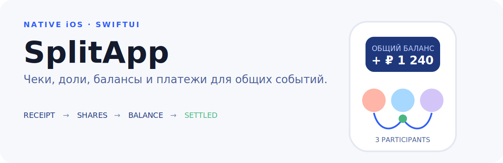

<p align="center">
  
</p>

SplitApp — нативное iOS-приложение для совместных расходов: события,
участники, чеки, доли, балансы, платежи и авторизация через Yandex OAuth.

## Пользовательский поток

```text
событие → чек → позиции и участники → доли → баланс → подтверждение платежа
```

Кодовая база включает SwiftUI feature-модули, интеграцию с backend API,
Core Data, Keychain-хранилище токенов и unit-тесты доменных/UI-контрактов.

## Быстрый старт

1. Откройте `SplitApp.xcodeproj` в Xcode.
2. Выберите scheme `SplitApp`.
3. Запустите приложение на iOS Simulator или устройстве.

## Быстрые ссылки

- Frontend repository: [Strongf-bob/SplitApp](https://github.com/Strongf-bob/SplitApp)
- Backend repository: [Strongf-bob/SplitAppBackend](https://github.com/Strongf-bob/SplitAppBackend)
- Backend OpenAPI: [openapi.yaml](https://github.com/Strongf-bob/SplitAppBackend/blob/main/openapi.yaml)
- Backend Wiki source: [docs/wiki](https://github.com/Strongf-bob/SplitAppBackend/tree/main/docs/wiki)
- Frontend/backend alignment backlog: [FRONTEND_BACKEND_TODO.md](https://github.com/Strongf-bob/SplitApp/blob/main/FRONTEND_BACKEND_TODO.md)

## Wiki

Русская документация лежит в [docs/wiki](https://github.com/Strongf-bob/SplitApp/tree/main/docs/wiki).

- [Главная](docs/wiki/Home.md)
- [Обзор проекта](docs/wiki/Project-Overview.md)
- [Доменные сценарии](docs/wiki/Domain-Flows.md)
- [Локальный запуск](docs/wiki/Local-Setup.md)
- [Архитектура iOS-приложения](docs/wiki/iOS-Architecture.md)
- [Интеграция с backend API](docs/wiki/Backend-Integration.md)
- [Авторизация и безопасность](docs/wiki/Authentication-And-Security.md)
- [Локальные данные и синхронизация](docs/wiki/Data-And-Sync.md)
- [Тесты и проверки](docs/wiki/Testing-And-Quality.md)
- [Эксплуатация и релиз](docs/wiki/Operations-And-Release.md)
- [Онбординг](docs/wiki/Onboarding.md)
- [Поддержка Wiki](docs/wiki/Wiki-Maintenance.md)

## Коротко о runtime

- Platform: iOS, Swift, SwiftUI.
- Project: [SplitApp.xcodeproj](https://github.com/Strongf-bob/SplitApp/tree/main/SplitApp.xcodeproj).
- Network: [APIClient.shared](https://github.com/Strongf-bob/SplitApp/blob/main/SplitApp/Core/Network/APIClient.swift) и endpoint structs в [SplitApp/Data/Network/Endpoints](https://github.com/Strongf-bob/SplitApp/tree/main/SplitApp/Data/Network/Endpoints).
- Backend base URL задан в [APIConfiguration.swift](https://github.com/Strongf-bob/SplitApp/blob/main/SplitApp/Core/Network/APIConfiguration.swift) как `https://split-app.ru`.
- Local persistence: [CoreDataStore](https://github.com/Strongf-bob/SplitApp/blob/main/SplitApp/Core/Database/CoreDataStore.swift).
- Secure token storage: [KeychainStorage](https://github.com/Strongf-bob/SplitApp/blob/main/SplitApp/Core/Auth/KeychainStorage.swift).

## Разработка

Для backend-разработки держите рядом
[SplitAppBackend](https://github.com/Strongf-bob/SplitAppBackend) и сверяйте
изменения с [Backend Integration](docs/wiki/Backend-Integration.md).

Перед изменениями сетевого контракта синхронизируйте:

- backend route/service/schema code;
- [openapi.yaml](https://github.com/Strongf-bob/SplitAppBackend/blob/main/openapi.yaml);
- frontend DTO, mapper, endpoint и repository layer;
- wiki-страницы в обоих репозиториях.
