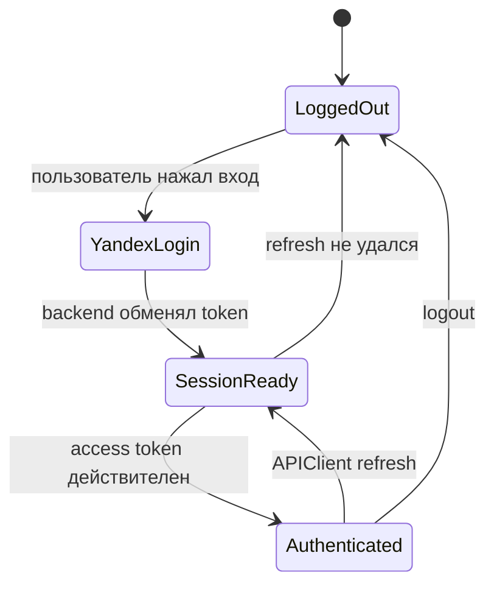

# Авторизация и безопасность

Вход состоит из двух разных доверенных границ: Yandex Login подтверждает личность пользователя, затем backend выдаёт сессию SplitApp. iOS не хранит refresh token в `UserDefaults`; для него используется [KeychainStorage](https://github.com/Strongf-bob/SplitApp/blob/main/SplitApp/Core/Auth/KeychainStorage.swift).

## Жизненный цикл сессии

Источники: [YandexAuthProviderImpl](https://github.com/Strongf-bob/SplitApp/blob/main/SplitApp/Core/Auth/Provider/YandexAuthProviderImpl.swift), [AuthServicesImpl](https://github.com/Strongf-bob/SplitApp/blob/main/SplitApp/Features/Authorization/Services/AuthServicesImpl.swift), [BootstrapAuthUseCase](https://github.com/Strongf-bob/SplitApp/blob/main/SplitApp/Features/Authorization/Services/BootstrapAuthUseCase.swift), [LogoutUseCase](https://github.com/Strongf-bob/SplitApp/blob/main/SplitApp/Features/Authorization/Services/LogoutUseCase.swift).

## Где что хранится

| Данные | Место | Назначение | Нельзя считать |
| --- | --- | --- | --- |
| Access token | memory `TokenStore` | заголовок запросов и короткий срок жизни | долговременной сессией |
| Refresh token | Keychain | восстановление сессии после запуска | UI-флагом входа |
| Current user | `CurrentUserStore` и кэш | быстрый старт профиля | доказательством валидной сессии |
| Права на действие | backend | доступ к событиям, платежам и данным | ответственностью UI |

При старте [SplitAppApp](https://github.com/Strongf-bob/SplitApp/blob/main/SplitApp/App/SplitAppApp.swift) проверяет refresh token, восстанавливает кэш пользователя и выполняет `BootstrapAuthUseCase`. При неудаче очищаются refresh token, `TokenStore` и профильный кэш, после чего показывается login.

## Правила для разработчика

- Не добавляйте токены, client secret, receipt image URL с подписью или персональные данные в логи.
- Каждый новый защищённый endpoint проверяйте на `401`, `403` и user-facing сообщение через [UserFacingErrorMapper](https://github.com/Strongf-bob/SplitApp/blob/main/SplitApp/Shared/Errors/UserFacingErrorMapper.swift).
- `APIClient` — единственное место, где должно формироваться Bearer-авторизация и refresh/retry. См. [APIClient](https://github.com/Strongf-bob/SplitApp/blob/main/SplitApp/Core/Network/APIClient.swift).
- Ограничения прав описывает backend: [Authentication and Security](https://github.com/Strongf-bob/SplitAppBackend/blob/main/docs/wiki/Authentication-And-Security.md).

Дальше: [Интеграция с backend](Backend-Integration) и [Тесты](Testing-And-Quality).
