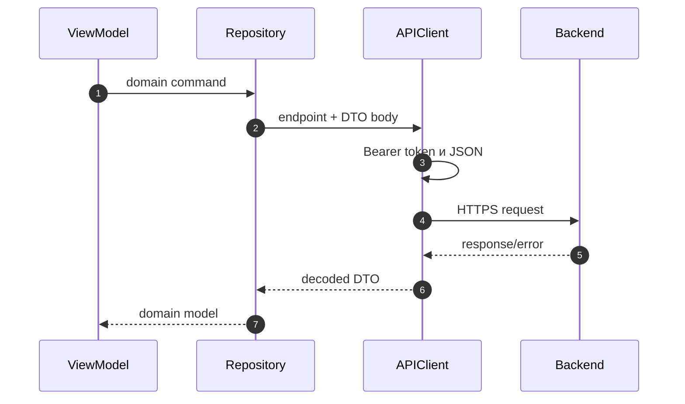

# Интеграция с backend API

Backend-контракт — это [OpenAPI](https://github.com/Strongf-bob/SplitAppBackend/blob/main/openapi.yaml). iOS-приложение обращается к нему через `APIClient` с базовым URL `https://split-app.ru`, заданным в [APIConfiguration](https://github.com/Strongf-bob/SplitApp/blob/main/SplitApp/Core/Network/APIConfiguration.swift). Локальные Swift structs — адаптеры клиента, а не самостоятельный контракт.

## Карта реализованных клиентских вызовов

| Область | iOS endpoint | Backend-контракт | Клиентская реализация |
| --- | --- | --- | --- |
| События | `GET/POST /api/events`, `PATCH/DELETE /api/events/{id}` | [events](https://github.com/Strongf-bob/SplitAppBackend/blob/main/openapi.yaml) | [EventEndpoints](https://github.com/Strongf-bob/SplitApp/blob/main/SplitApp/Data/Network/Endpoints/EventEndpoints.swift) |
| Участники | `POST/DELETE /api/events/{id}/participants` | [events](https://github.com/Strongf-bob/SplitAppBackend/blob/main/openapi.yaml) | [EventEndpoints](https://github.com/Strongf-bob/SplitApp/blob/main/SplitApp/Data/Network/Endpoints/EventEndpoints.swift) |
| Чеки | `GET/POST /api/events/{id}/receipts`, `PATCH/DELETE /api/receipts/{id}` | [receipts](https://github.com/Strongf-bob/SplitAppBackend/blob/main/openapi.yaml) | [ReceiptEndpoints](https://github.com/Strongf-bob/SplitApp/blob/main/SplitApp/Data/Network/Endpoints/ReceiptEndpoints.swift) |
| Изображения | `POST /api/receipts/{id}/image`, presigned URL | [receipt image](https://github.com/Strongf-bob/SplitAppBackend/blob/main/openapi.yaml) | [ReceiptEndpoints](https://github.com/Strongf-bob/SplitApp/blob/main/SplitApp/Data/Network/Endpoints/ReceiptEndpoints.swift) |
| Балансы | `GET /api/events/{id}/balances` | [balances](https://github.com/Strongf-bob/SplitAppBackend/blob/main/openapi.yaml) | [BalanceEndpoints](https://github.com/Strongf-bob/SplitApp/blob/main/SplitApp/Data/Network/Endpoints/BalanceEndpoints.swift) |
| Платежи | `GET/POST /api/events/{id}/payments`, `PATCH /api/payments/{id}` | [payments](https://github.com/Strongf-bob/SplitAppBackend/blob/main/openapi.yaml) | [PaymentEndpoints](https://github.com/Strongf-bob/SplitApp/blob/main/SplitApp/Data/Network/Endpoints/PaymentEndpoints.swift) |
| Друзья | `GET /api/friends`, accept/reject/delete | [friends](https://github.com/Strongf-bob/SplitAppBackend/blob/main/openapi.yaml) | [FriendshipEndpoints](https://github.com/Strongf-bob/SplitApp/blob/main/SplitApp/Data/Network/Endpoints/FriendshipEndpoints.swift) |
| Сплитик | session, message, draft commit | [splitik](https://github.com/Strongf-bob/SplitAppBackend/blob/main/openapi.yaml) | [SplitikEndpoints](https://github.com/Strongf-bob/SplitApp/blob/main/SplitApp/Data/Network/Endpoints/SplitikEndpoints.swift) |

## Путь одного запроса

Источник: [APIClient](https://github.com/Strongf-bob/SplitApp/blob/main/SplitApp/Core/Network/APIClient.swift), [ReceiptsDataRepository](https://github.com/Strongf-bob/SplitApp/blob/main/SplitApp/Data/Repositories/ReceiptsRepository.swift), [EventMapper](https://github.com/Strongf-bob/SplitApp/blob/main/SplitApp/Data/Mappers/EventMapper.swift).

## Правила совместимости

1. Сначала изменяется и проверяется backend route/schema/service и `openapi.yaml`.
2. Затем синхронно обновляются iOS endpoint, DTO, mapper, repository и UI, если поле влияет на экран.
3. Деньги и статусы не вычисляются как окончательная истина на клиенте: показывайте ответ backend.
4. При ошибке `401` APIClient обновляет access token; повторяющийся сбой завершает сессию. Подробности — в [Авторизации](Authentication-And-Security).
5. Для действий с чеком и платежом не удаляйте idempotency header без согласованной правки backend.

Связанный документ backend: [iOS Frontend Integration](https://github.com/Strongf-bob/SplitAppBackend/blob/main/docs/wiki/iOS-Frontend-Integration.md). Дальше: [Тесты и качество](Testing-And-Quality).
