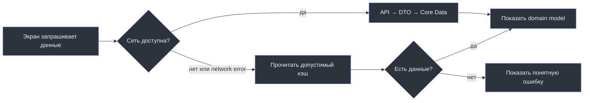

# Локальные данные и синхронизация

Кэш нужен, чтобы экран открывался быстрее и приложение было полезно при кратком обрыве сети. Он не является финансовым источником правды: серверный ответ определяет итог событий, долей, балансов и платежей.

## Где находятся данные

| Данные | Локальный механизм | Когда обновляется | Поведение без сети |
| --- | --- | --- | --- |
| События | Core Data | после успешной загрузки/мутации | repository может вернуть кэш |
| Чеки | Core Data + `LocalReceiptsStore` | после network success; есть fallback | список/редактирование используют локальные данные по правилам repository |
| Платежи | Core Data | после list/create/update | при пустом кэше бросается `offlineNoCache` |
| Текущий пользователь | `CurrentUserStore` | login/bootstrap/profile | не авторизует сам по себе |

Источники: [CoreDataStore](https://github.com/Strongf-bob/SplitApp/blob/main/SplitApp/Core/Database/CoreDataStore.swift), [EventsDataRepository](https://github.com/Strongf-bob/SplitApp/blob/main/SplitApp/Data/Repositories/EventsRepository.swift), [ReceiptsDataRepository](https://github.com/Strongf-bob/SplitApp/blob/main/SplitApp/Data/Repositories/ReceiptsRepository.swift), [PaymentsDataRepository](https://github.com/Strongf-bob/SplitApp/blob/main/SplitApp/Data/Repositories/PaymentsRepository.swift).

## Модель обновления

## Важные ограничения

- Создание/редактирование чека в UI запрещается без сети; это отдельное правило [BillViewModel](https://github.com/Strongf-bob/SplitApp/blob/main/SplitApp/Features/BillEntry/ViewModels/BillViewModel.swift), даже при наличии кэша.
- `ReceiptsDataRepository` реализует local fallback для connectivity ошибок. Не расширяйте это правило на ошибки валидации, прав или бизнес-правил: они должны быть показаны пользователю.
- При создании чека изображение загружается после основного объекта; failure загрузки изображения не отменяет созданный чек. См. [путь создания чека](https://github.com/Strongf-bob/SplitApp/blob/main/SplitApp/Data/Repositories/ReceiptsRepository.swift).
- Core Data операции выполняются через [performBackground](https://github.com/Strongf-bob/SplitApp/blob/main/SplitApp/Core/Database/CoreDataStore.swift), а UI-state остаётся на `MainActor`.

Дальше: [Доменные сценарии](Domain-Flows) и [Архитектура iOS](iOS-Architecture).
