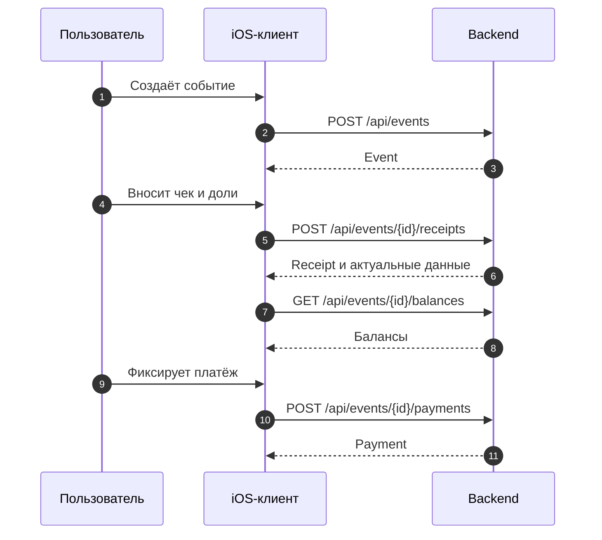

# Доменные сценарии

Эта страница объясняет бизнес-логику, а не внутреннее устройство экранов. Backend определяет, разрешено ли действие и как меняются деньги; iOS-клиент показывает состояние и отправляет команды через repository layer.

## Основной путь расходов

| Шаг | Что делает пользователь | Что делает iOS | Кто определяет итог |
| --- | --- | --- | --- |
| 1 | входит | получает сессию и текущий профиль | backend |
| 2 | создаёт событие и добавляет людей | вызывает event endpoints | backend |
| 3 | сканирует или вводит чек | собирает позиции, плательщика и доли | backend после сохранения |
| 4 | смотрит долги | получает balances для события | backend |
| 5 | создаёт/подтверждает оплату | передаёт команду платежа | backend |
| 6 | закрывает событие | показывает доступное UI-действие | backend и права пользователя |

Источники: [event endpoints](https://github.com/Strongf-bob/SplitApp/blob/main/SplitApp/Data/Network/Endpoints/EventEndpoints.swift), [receipt endpoints](https://github.com/Strongf-bob/SplitApp/blob/main/SplitApp/Data/Network/Endpoints/ReceiptEndpoints.swift), [payment endpoints](https://github.com/Strongf-bob/SplitApp/blob/main/SplitApp/Data/Network/Endpoints/PaymentEndpoints.swift), [OpenAPI](https://github.com/Strongf-bob/SplitAppBackend/blob/main/openapi.yaml).

## Важные правила

| Правило | Практический смысл | Где видно |
| --- | --- | --- |
| Закрытое событие — read-only для чека | UI не даёт сохранить изменения | [BillViewModel](https://github.com/Strongf-bob/SplitApp/blob/main/SplitApp/Features/BillEntry/ViewModels/BillViewModel.swift) |
| Создание чека идемпотентно | повторная отправка получает ключ `Idempotency-Key` | [CreateReceiptEndpoint](https://github.com/Strongf-bob/SplitApp/blob/main/SplitApp/Data/Network/Endpoints/ReceiptEndpoints.swift) |
| Фото чека — отдельный шаг | ошибка загрузки изображения не отменяет уже созданный чек | [ReceiptsDataRepository](https://github.com/Strongf-bob/SplitApp/blob/main/SplitApp/Data/Repositories/ReceiptsRepository.swift) |
| Локальные записи не заменяют сервер | offline fallback нужен для продолжения UX, а не для окончательного расчёта | [Data and Sync](Data-And-Sync) |

## Сплитик

Клиент загружает текущую сессию, отправляет сообщение и отображает draft-действия. Выполнение draft выполняется только по явному подтверждению пользователя через endpoint commit; в iOS нет права самостоятельно применять предложение модели. См. [SplitikChatViewModel](https://github.com/Strongf-bob/SplitApp/blob/main/SplitApp/Features/Navigation/ViewModels/SplitikChatViewModel.swift) и [backend Wiki о Сплитике](https://github.com/Strongf-bob/SplitAppBackend/blob/main/docs/wiki/Splitik-Agent.md).

Дальше: [Интеграция с backend](Backend-Integration) и [Данные и синхронизация](Data-And-Sync).
