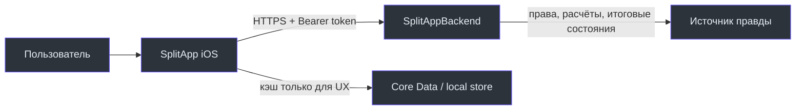

# SplitApp iOS Wiki

Это рабочая документация нативного iOS-клиента SplitApp: приложения для совместных расходов в событиях. Она описывает то, что клиент действительно делает сейчас, и отделяет это от более широких возможностей backend. Исходник Wiki живёт в [`docs/wiki`](https://github.com/Strongf-bob/SplitApp/tree/main/docs/wiki) и зеркально публикуется в [GitHub Wiki](https://github.com/Strongf-bob/SplitApp/wiki).

## Выберите маршрут

| Нужно понять | Страница | Что в ней есть |
| --- | --- | --- |
| Какую пользу получает пользователь | [Обзор продукта](Project-Overview) | границы продукта, экраны и сущности |
| Как проходят события, чеки и расчёты | [Доменные сценарии](Domain-Flows) | бизнес-правила и граница ответственности backend |
| Как устроен Swift-клиент | [Архитектура iOS](iOS-Architecture) | слои, DI, навигация и точки расширения |
| Как не сломать API-связку | [Интеграция с backend](Backend-Integration) | OpenAPI, endpoints, DTO и совместимость |
| Как работают вход и токены | [Авторизация и безопасность](Authentication-And-Security) | Yandex OAuth, refresh и Keychain |
| Что остаётся на устройстве | [Данные и синхронизация](Data-And-Sync) | Core Data, fallback и ограничения offline |
| Как запустить, проверить и выпустить | [Запуск](Local-Setup), [Качество](Testing-And-Quality), [Релиз](Operations-And-Release) | практические команды и release checklist |
| Как войти в проект | [Онбординг](Onboarding) | первые 30 минут и чтение кода |

## Системы и источник правды

| Система | За что отвечает | Основная ссылка |
| --- | --- | --- |
| iOS-клиент | SwiftUI-интерфейс, безопасное хранение сессии, локальный кэш и запросы | [SplitApp](https://github.com/Strongf-bob/SplitApp) |
| Backend | авторизация, права, деньги, состояния событий и API-контракт | [SplitAppBackend](https://github.com/Strongf-bob/SplitAppBackend) |
| Контракт | допустимые request/response, методы и статусы API | [openapi.yaml](https://github.com/Strongf-bob/SplitAppBackend/blob/main/openapi.yaml) |

Источники: [APIConfiguration](https://github.com/Strongf-bob/SplitApp/blob/main/SplitApp/Core/Network/APIConfiguration.swift), [APIClient](https://github.com/Strongf-bob/SplitApp/blob/main/SplitApp/Core/Network/APIClient.swift), [CoreDataStore](https://github.com/Strongf-bob/SplitApp/blob/main/SplitApp/Core/Database/CoreDataStore.swift).

## Правило актуальности

Документация не заменяет код и контракт. При расхождении приоритет такой: runtime backend и OpenAPI → Swift-код → Wiki. Правила обновления и зеркалирования — в [Поддержке Wiki](Wiki-Maintenance).
