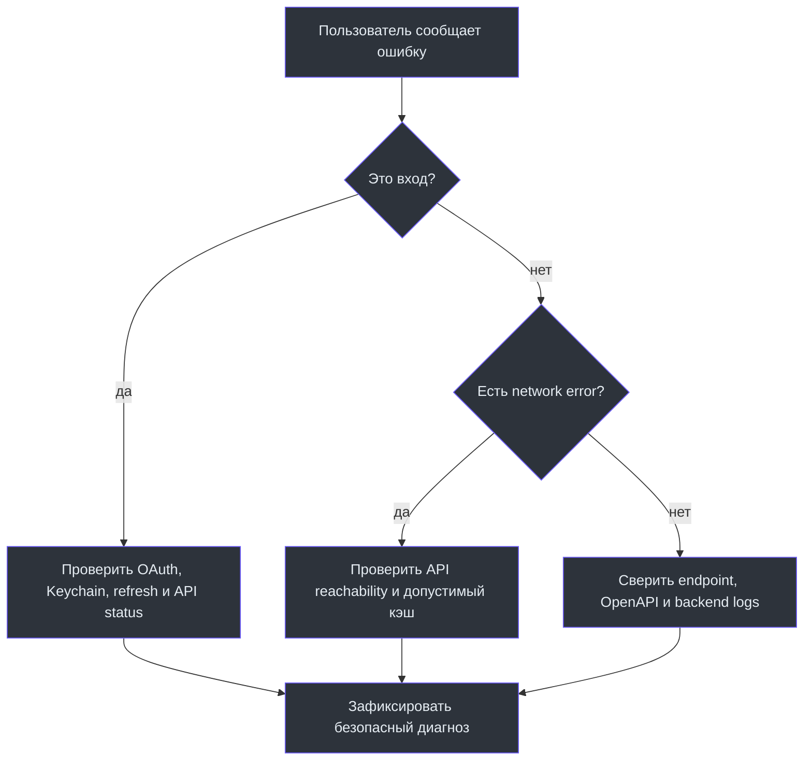

# Эксплуатация и релиз

Эта страница описывает контур iOS-клиента. Production API и observability принадлежат backend-репозиторию; подробности о Docker, метриках и инцидентах находятся в [backend Operations and Deployment](https://github.com/Strongf-bob/SplitAppBackend/blob/main/docs/wiki/Operations-And-Deployment.md).

## Перед выпуском

| Этап | Проверка | Владелец результата |
| --- | --- | --- |
| Конфигурация | production base URL и Yandex OAuth settings | iOS |
| Контракт | клиентские endpoint/DTO совпадают с OpenAPI | iOS + backend |
| Auth | login, restart, refresh, logout | iOS |
| Деньги | создание чека, балансы и платёж на тестовых пользователях | backend — финальная истина |
| Offline UX | кэш ясно маркирован; запись не выдаётся за подтверждённую | iOS |
| Наблюдаемость | server error и request trace доступны на backend | backend |

## Реакция на проблему

Не собирайте секреты, access/refresh tokens, изображения чеков и персональные данные в issue или общий лог. Для воспроизводимости достаточно времени, версии приложения, endpoint/HTTP-status без payload и безопасно обезличенного идентификатора запроса с backend.

Дальше: [Локальный запуск](Local-Setup), [Авторизация](Authentication-And-Security), [Тесты](Testing-And-Quality).
