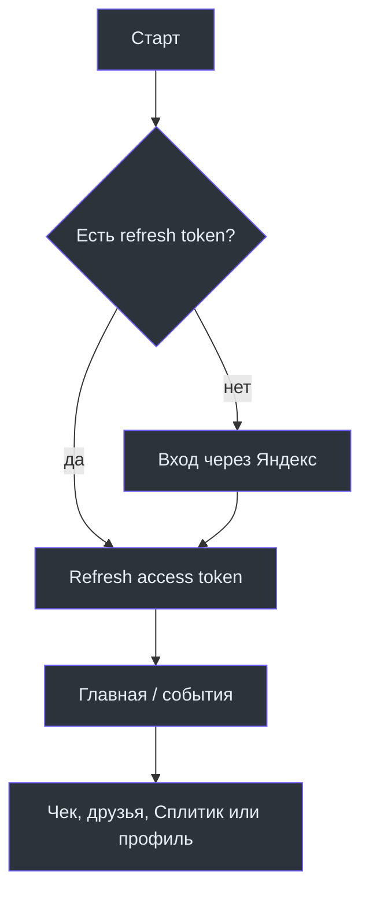

# Обзор продукта

SplitApp помогает группе людей вести общий расход без ручного пересчёта: создать событие, добавить участников, внести чек с позициями и долями, увидеть баланс и зафиксировать оплату. Нативный клиент построен на SwiftUI; окончательные права и финансовые состояния принадлежат backend, а не локальному устройству.

## Что доступно в приложении

| Возможность | Пользовательский результат | Клиентская точка | Граница backend |
| --- | --- | --- | --- |
| Вход | пользователь получает сессию SplitApp через Яндекс | [SplitAppApp](https://github.com/Strongf-bob/SplitApp/blob/main/SplitApp/App/SplitAppApp.swift) | обмен и refresh токенов |
| События | группа расходов и её участники | [EventsNavigationView](https://github.com/Strongf-bob/SplitApp/blob/main/SplitApp/Features/Navigation/Views/EventsNavigationView.swift) | `POST/GET/PATCH /api/events` |
| Чеки | позиции, плательщик, доли и фото чека | [BillViewModel](https://github.com/Strongf-bob/SplitApp/blob/main/SplitApp/Features/BillEntry/ViewModels/BillViewModel.swift) | `/api/events/{id}/receipts`, `/api/receipts/{id}` |
| Друзья | список связей, запросы и долги | [FriendsView](https://github.com/Strongf-bob/SplitApp/blob/main/SplitApp/Features/Friends/Views/FriendsView.swift) | `/api/friends` |
| Платежи | запись о переводе между участниками | [PaymentsDataRepository](https://github.com/Strongf-bob/SplitApp/blob/main/SplitApp/Data/Repositories/PaymentsRepository.swift) | `/api/events/{id}/payments` |
| Сплитик | вопрос к помощнику и подтверждение draft-действия | [SplitikChatViewModel](https://github.com/Strongf-bob/SplitApp/blob/main/SplitApp/Features/Navigation/ViewModels/SplitikChatViewModel.swift) | `/api/splitik/*` |

## Что не следует обещать от имени iOS-клиента

Backend-контракт содержит, в частности, disputes, confirmation summaries, settlement plans и AI receipt drafts. Наличие пути в [OpenAPI](https://github.com/Strongf-bob/SplitAppBackend/blob/main/openapi.yaml) не означает, что в текущем iOS UI есть завершённый экран для него. Перед продуктовым обещанием сверяйте endpoint с [картой интеграции](Backend-Integration) и соответствующим Swift feature.

## Навигация

После загрузки сессии корневой `ContentView` собирает `BottomTabBarView`. Вкладки: «Главная», «Друзья», «Сплитик», «События» и «Профиль»; начальная вкладка — «Главная». Конфигурация и зависимости создаются в [BottomTabConfiguration](https://github.com/Strongf-bob/SplitApp/blob/main/SplitApp/Features/Navigation/Models/BottomTabConfiguration.swift).

Источники: [SplitAppApp](https://github.com/Strongf-bob/SplitApp/blob/main/SplitApp/App/SplitAppApp.swift), [ContentView](https://github.com/Strongf-bob/SplitApp/blob/main/SplitApp/App/ContentView.swift), [BottomTabBarView](https://github.com/Strongf-bob/SplitApp/blob/main/SplitApp/Features/Navigation/Views/BottomTabBarView.swift).

Дальше: [Доменные сценарии](Domain-Flows) и [Архитектура iOS](iOS-Architecture).
