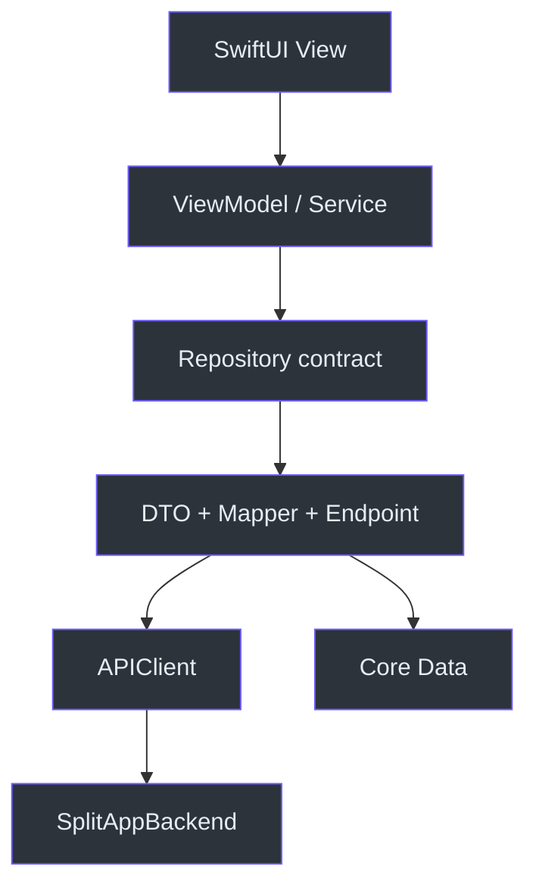

# Архитектура iOS-приложения

Клиент разделён так, чтобы SwiftUI-экран не знал ни URL, ни JSON-форму backend: UI вызывает view model, та использует domain contract или service, repository выполняет запрос и маппинг. Live-зависимости собираются в одном месте — [AppDependencies](https://github.com/Strongf-bob/SplitApp/blob/main/SplitApp/App/AppDependencies.swift).

## Слои и зависимости

| Слой | Ответственность | Примеры |
| --- | --- | --- |
| App | запуск, root state и сборка live dependencies | [App](https://github.com/Strongf-bob/SplitApp/tree/main/SplitApp/App) |
| Features | SwiftUI, view models, пользовательские состояния | [Features](https://github.com/Strongf-bob/SplitApp/tree/main/SplitApp/Features) |
| Domain | модели, команды и repository contracts | [Domain](https://github.com/Strongf-bob/SplitApp/tree/main/SplitApp/Domain) |
| Data | endpoints, DTO, mapper-ы, repositories и Core Data адаптеры | [Data](https://github.com/Strongf-bob/SplitApp/tree/main/SplitApp/Data) |
| Core | сеть, авторизация, Keychain, Core Data и network reachability | [Core](https://github.com/Strongf-bob/SplitApp/tree/main/SplitApp/Core) |

Источники: [AppDependencies](https://github.com/Strongf-bob/SplitApp/blob/main/SplitApp/App/AppDependencies.swift), [Endpoint](https://github.com/Strongf-bob/SplitApp/blob/main/SplitApp/Core/Network/Endpoint.swift), [EventsRepository contract](https://github.com/Strongf-bob/SplitApp/blob/main/SplitApp/Domain/Repositories/EventsRepositoryContract.swift).

## Навигация и composition root

`SplitAppApp` строит auth-сервисы и решает, показывать ли login или `ContentView`. `ContentView` создаёт tab configuration; для событий он передаёт repositories и `EventManagementService` в `EventsNavigationView`. Navigation view владеет маршрутом, создаёт `BillViewModel` для full-screen редактора чека и обновляет данные после закрытия редактора. См. [SplitAppApp](https://github.com/Strongf-bob/SplitApp/blob/main/SplitApp/App/SplitAppApp.swift), [BottomTabConfiguration](https://github.com/Strongf-bob/SplitApp/blob/main/SplitApp/Features/Navigation/Models/BottomTabConfiguration.swift), [EventsNavigationView](https://github.com/Strongf-bob/SplitApp/blob/main/SplitApp/Features/Navigation/Views/EventsNavigationView.swift).

## Правила изменения кода

- Новый API-вызов: endpoint → DTO → mapper → repository contract/реализация → view model → view; сверить с [OpenAPI](https://github.com/Strongf-bob/SplitAppBackend/blob/main/openapi.yaml).
- Не создавайте `URLSession`, Keychain или repository в SwiftUI view.
- Не передавайте backend DTO через feature UI, если уже есть domain model.
- Dependencies инъецируйте в тестируемые init-параметры; `AppDependencies.live` — composition root, а не глобальное место бизнес-логики.

Дальше: [Авторизация](Authentication-And-Security), [Данные и синхронизация](Data-And-Sync) и [Онбординг](Onboarding).
